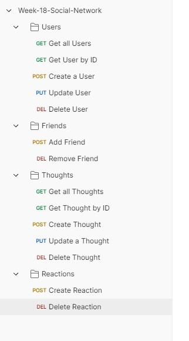

# MongoDB Social Network API

## User Story

```md
AS A social media startup
I WANT an API for my social network that uses a NoSQL database
SO THAT my website can handle large amounts of unstructured data
```

## Acceptance Criteria

```md
GIVEN a social network API
WHEN I enter the command to invoke the application
THEN my server is started and the Mongoose models are synced to the MongoDB database
WHEN I open API GET routes in Insomnia for users and thoughts
THEN the data for each of these routes is displayed in a formatted JSON
WHEN I test API POST, PUT, and DELETE routes in Insomnia
THEN I am able to successfully create, update, and delete users and thoughts in my database
WHEN I test API POST and DELETE routes in Insomnia
THEN I am able to successfully create and delete reactions to thoughts and add and remove friends to a user’s friend list
```

## Description

This project consists in a MongoDB Social Network API that will give us some details when we request from it. We are able to get information about Users, Thoughts, Friends and Reactions. Also using this API we can update them, creaate and delete them. This project contains 15 JavaScript files .

The biggest challenge for me during this project was the refactoring process, since i used mini project 28 as a base i had to adjust a lot , and at the end i noticed a lot of namings were different from what they were supposed to be. Another challenge was definitly the testing in postman since i still dont work that good with it. 

This challenge helped me a lot because it made my understanding of API higher and also made more confident while working with postman in terms of fetiching the information and organise it so its understandable. There was a few more point in where this challenge helped me that i will be listing bellow.

- Better use of Postman
- Better API use
- Higher understanding of JavaScript

## Table of Contents

- [Installation](#installation)
- [Usage](#usage)
- [Tests](#tests)
- [License](#license)
- [Questions](#questions)

## Installation

To install the necessary dependencies, run the following command:

```
npm i
```

## Usage

To use this repository is pretty simple. You will have to clone the repo , and soon as you clone it and open it, you will need to open your terminal and run the following command (npm i). After installing everything you will need to run this following commands in your terminal (npm run seed) and after run (npm run start). After running this 2 commands you will see your localhost was made and you should be able to get the information on postman after that.



## Tests

I will be listing the tests i have done.

```
Tested - Get all Users
Tested - Get User by ID
Tested - Create a User
Tested - Update User
Tested - Delete User
Tested - Add Friend
Tested - Remove Friend
Tested - Get all Thoughts
Tested - Get Thought by ID
Tested - Create Thought
Tested - Update a Thought
Tested - Delete Thought
Tested - Create Reaction
Tested - Delete Reaction
```

## License


This project is licensed under the MIT license.

## Questions

For any questions or inquiries, feel free to reach out to me:

- GitHub: [DiogoS77](https://github.com/DiogoS77)
- Email: diogo.messi.18@hotmail.com
- [Watch the Video](https://drive.google.com/file/d/1R-FbcabcNoswx476t1MGIpSTM7HEOC1q/view)
